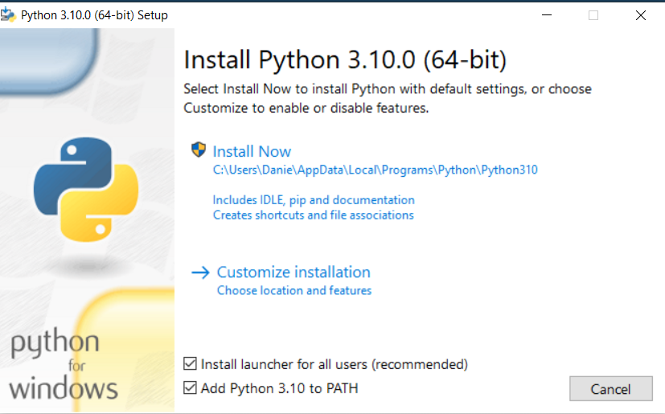
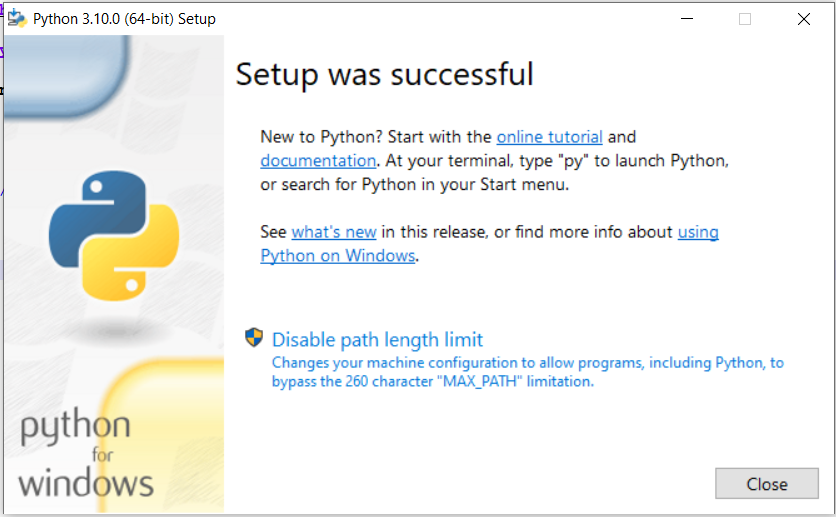

## Downloading and installing python

## Step 1 Download Python
<li>Go to he the python download page by clicking <a href="https://www.python.org/downloads/">here</a></li>
<li>Click Download Python 3.10.0</li>

## Install Python
Install Python
<li>The file will be downloaded, find the download and double click on it</li>
<li>Click on Add Python 3.10 to PATH </li>
<li>Finally click install Now </li>
<li>You may get a popup asking do you want to install, click yes</li>

  
