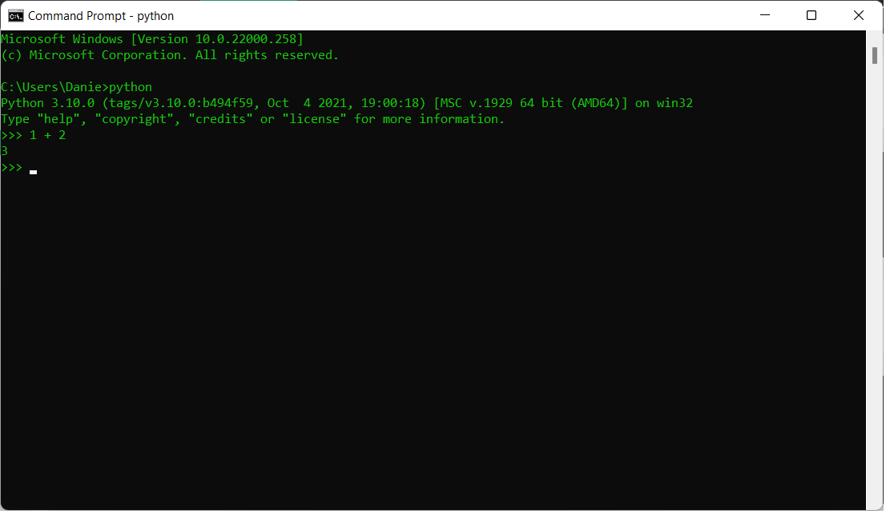
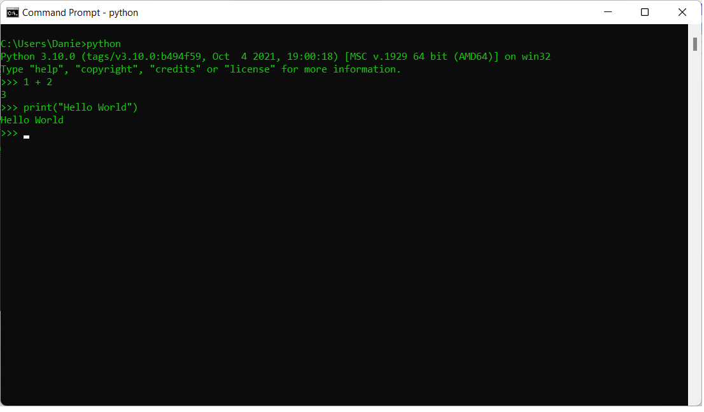
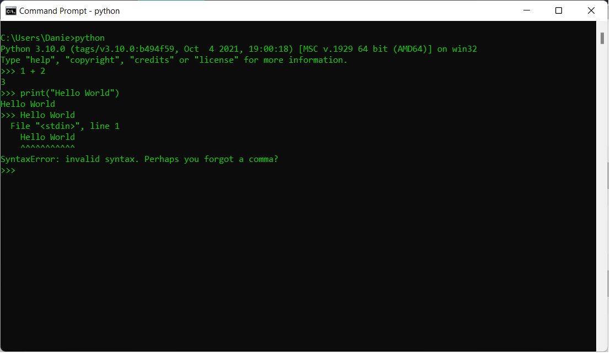
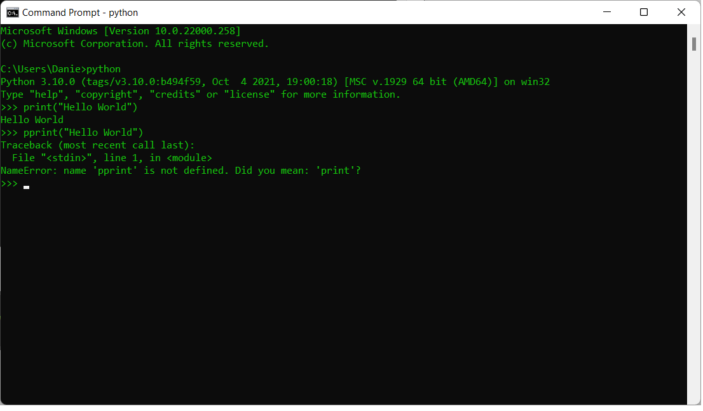

| [<< back](../)                  | [Home](https://daniel-jb.github.io/CoderDojo)      |
| -------------                   | -----:                                             |
|              |       |

## Python Command Line 

## Step 1 Open command line
<li>Open up your command line by clicking thw windows icon at the bottom left and typing in cmd</li>

## Step 2 Make sure the following window is visibile
<li>The following window should pop up, it may be different colors</li>

## Step 3 Check python is installed correctly
<li>Type in python --version and press enter to verify python is installed correct and to see what version is installed. Please notice there are two minus symbols before version</li>

## Step 4 Open the Python command line
<li>Type in python or py</li>

## Step 5 Enter some simple maths
<li>Type in 1 + 2 and press enter</li>
<li>Python will parse this command and give you a result</li>

## Step 6 Call the print function (Will explain later)
<li>Type in print("hello world") and press enter</li>

## Step 7 What happens if we don't use print 
<li>Type in hello world (No quotations) and press enter</li>

## Step 8 What happens if we mispell print 
<li>Type in pprint("hello world") and press enter</li>

