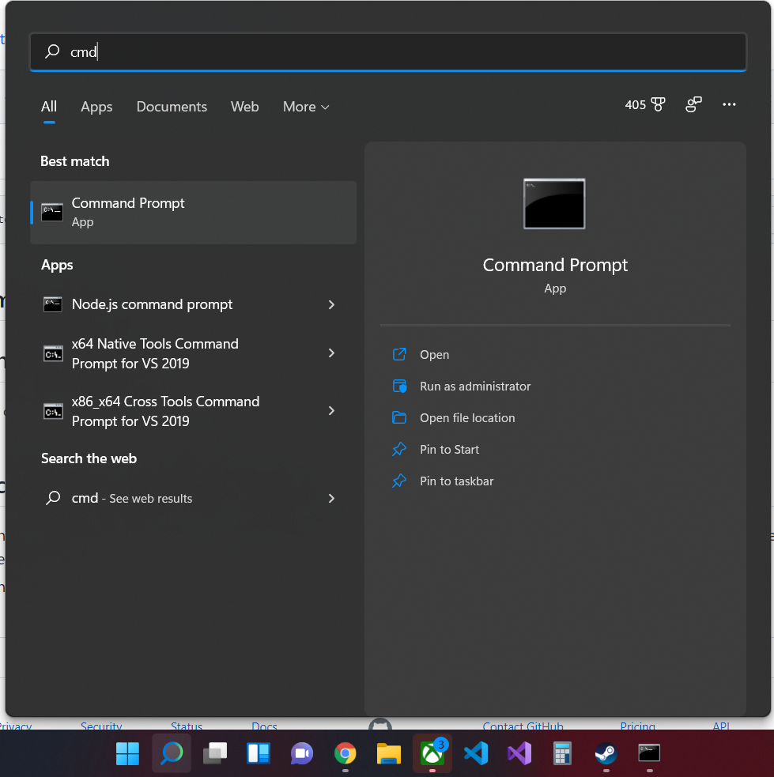
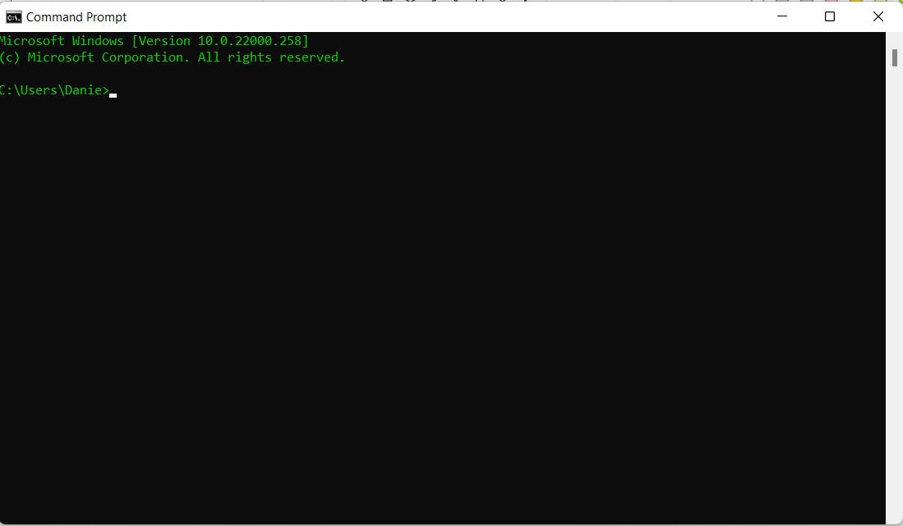
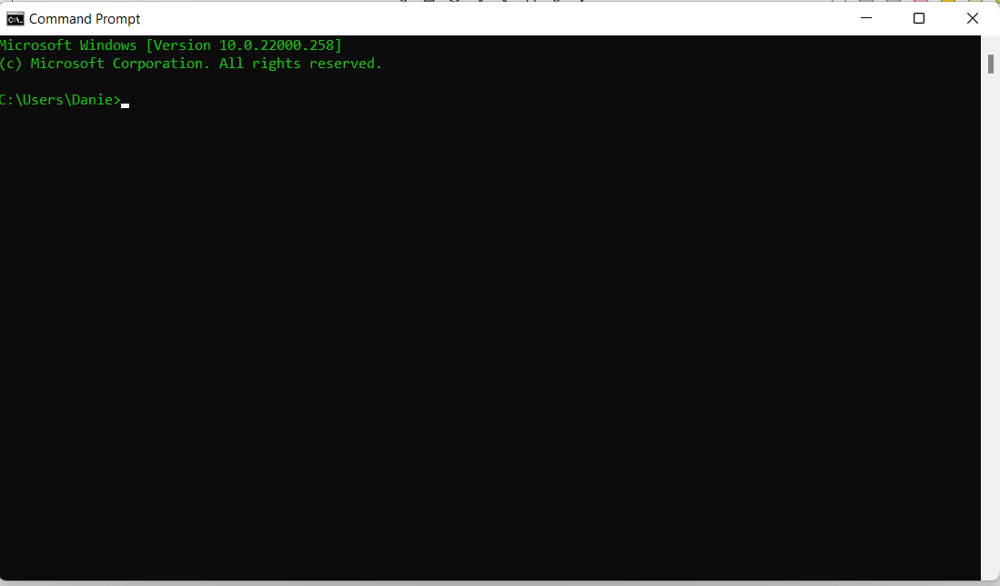
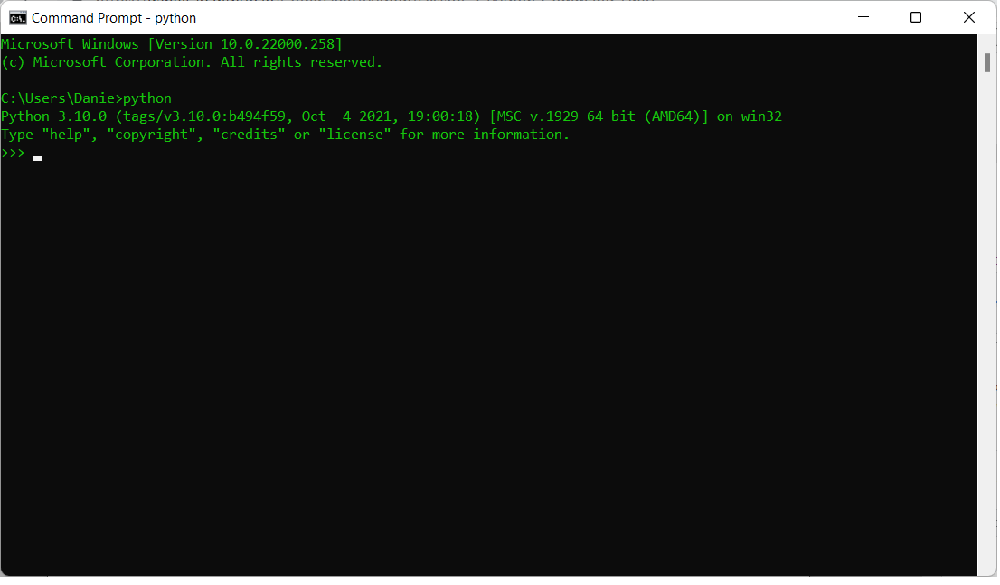

| [<< back](../)                  | [Home](https://daniel-jb.github.io/CoderDojo)      |
| -------------                   | -----:                                             |
| [<< back](../)                  | [Home](https://daniel-jb.github.io/CoderDojo)      |

## Python Command Line

## Step 1 Open command line
<li>Open up your command line by clicking thw windows icon at the bottom left and typing in cmd</li>

## Step 2 Make sure the following window is visibile
<li>The following window should pop up, it may be different colors</li>

## Step 3 Check python is installed correctly
<li>Type in python --version and press enter to verify python is installed correct and to see what version is installed. Please notice there are two minus symbols before version</li>

## Step 4 Open the Python command line
<li>Type in python or py</li>

