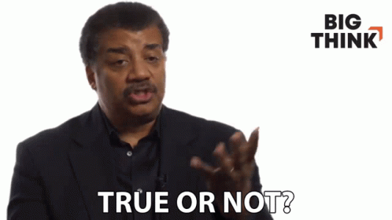
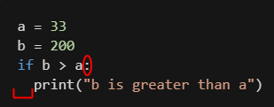

<style> 
 .markdown-body table {
   margin-bottom: -40px;
 }
 
 .markdown-body tbody {
    border-top: 2px solid #FFFFFF;
    border-bottom: 2px solid #FFFFFF;
    background-color: #FFFFFF;
}
 
.markdown-body td {
    border-right: 1px solid #FFFFFF;
    border-bottom: 1px solid #FFFFFF;
    padding: 5px;
}
</style>

| [<< back](../)| [Home](https://daniel-jb.github.io/CoderDojo)      |
| ------------- | -----:                                             |
|               |                                  |

<br />

# LESSON 4 IF STATEMENTS

## 1️⃣ IF

- an if statement is used to check if things are true or false.



```python
a = 33
b = 200
if b > a:
  print("b is greater than a")
```
- what will this code do? 
  - is 200 greater than 33?



### **Syntax**
- start the if statement with an `if`
- the part after that is called the `condition`. This is what we are checking is true or not.
- The `:` 👈 is the end of the `condition`.
- if it is true it will do everything after the `:`

<br/>

### SPACING
- *notice the space before print.* thats called an 🎉`indentation`🎉.
- without that the code will not.
- the indentation tells python this is the code it wants to run.

<br/>

### examples of using if statements:

```python
trafficLights = "green"
if trafficLights == "green":
  print("DRIVE DRIVE DRIVE")
```

```python
typedPassword = input('Enter your password:')

password = "12345"

if password == typedPassword:
  print("i'm in")
```
<br/>

## 2️⃣ What Else?

### ELSE

- what if we wanted something to happen if the `condition` fails?

```python
a = 999
b = 2

if b > a:
  print("b is greater than a")
else:
  print("a is great than b")
```
- what will this print?
- `else` 👈 will only happy if the condition is false.

Examples of Else:
```python
typedPassword = input('Enter your password:')

password = "12345"

if password == typedPassword:
  print("i'm in")
else
  print("incorrect, get outta here")
```

### ELIF

- what if we wanted to check for multiple things?
- we would use an `elif`.
 
 `else + if = elif`


- what will this code do?
```python
a = 33
b = 33
if b > a:
  print("b is greater than a")
elif a == b:
  print("a and b are equal")
```
- now there is 2 `conditions` in the statement
- ***notice the indentation* spacing is very important in python**

### More Examples

```python
trafficLights = "green"
if trafficLights == "green":
  print("DRIVE DRIVE DRIVE")
elif trafficLights == "orange":
  print("DRIVE LESS")
elif trafficLights == "RED":
  print("no drive")
```

```python
if a > b and c > a:
  print("Both conditions are True")
```
<!-- 
## 2️⃣ While 
- coming soon
```python
i = 1
while i < 6:
  print(i)
  if i == 3:
    break
  i += 1 
``` -->