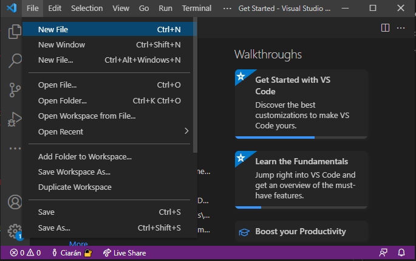
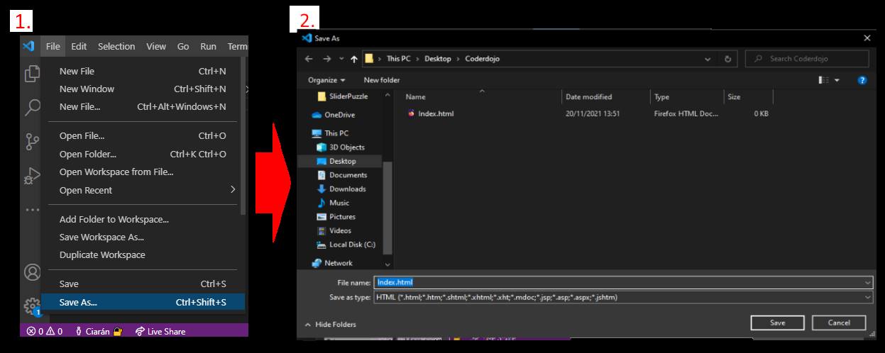
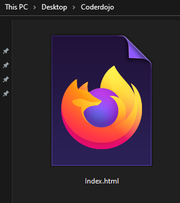
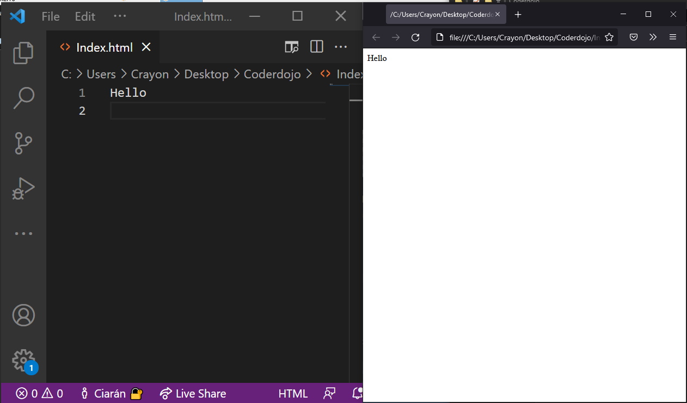
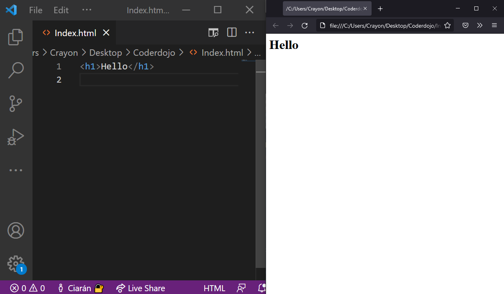
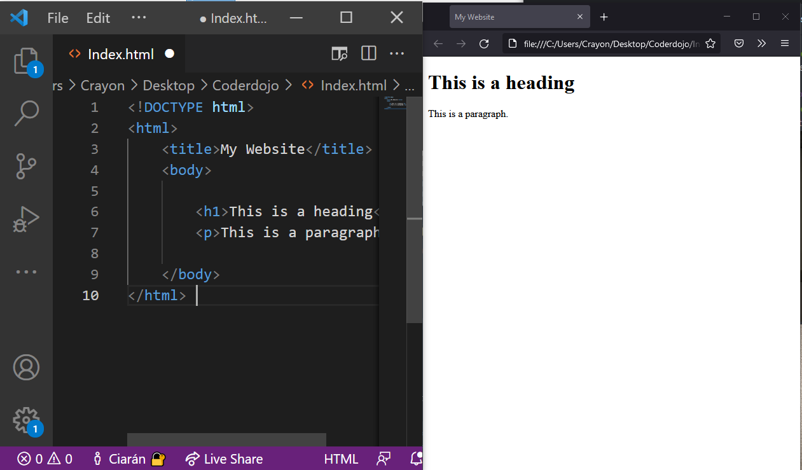
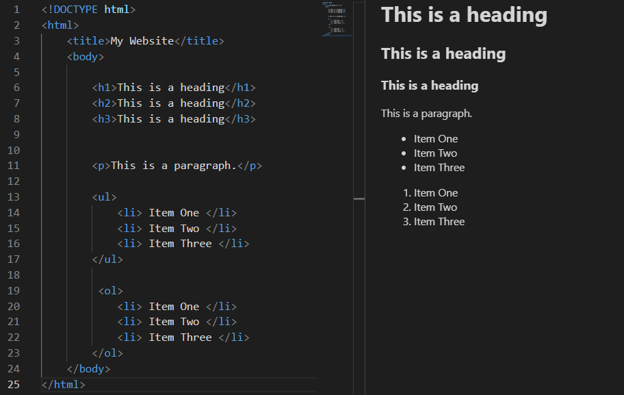

<style> 
 .markdown-body table {
   margin-bottom: -40px;
 }
 
 .markdown-body tbody {
    border-top: 2px solid #FFFFFF;
    border-bottom: 2px solid #FFFFFF;
    background-color: #FFFFFF;
}
 
.markdown-body td {
    border-right: 1px solid #FFFFFF;
    border-bottom: 1px solid #FFFFFF;
    padding: 5px;
}
</style>

| [<< back](../) | [Home](https://daniel-jb.github.io/CoderDojo) |
| -------------|-----:|
|              |      |

# LESSON 1

## 1️⃣ Creating a HTML File

The best place to start would be **Making a HTML file**. 

#### HOW:
1. Open Visual Studio Code.
    - Just find where it is installed on your pc.
2. **Create a new File**


3. **Save as a HTML File**

    - CTRL + SHIFT + S ~> shortcut to save.
    - name the file anything **just make sure it ends in .html** (this tells your computer that it is a HTML file).


- your file will now be openable with a web browser ( I use firefox 😎).
- you can open it now but it isn't gonna look like much (or anything for that matter).

lets start adding code

## 2️⃣ Coding

<br/>

### 1. Typle some words

- Anything you type in the html file will show up in your browser (*you may need to refresh your browser to see the changes*).

<br/>

### 2. Tags

- The words are very small so we **wrap** our word in a **h1 tag**.


- Anything Surrounded by these 👉 <> are called **Tags**
    - Each one does something different and there are A LOT of tags.
    - The `<h1>` tag tells the browser that anything in it is a **header**. It will make the Text bigger.

    - this starts a tag 👉`<h1>`
    - and this ends a tag `</h1>`
    - anything between is effect by it

<br/>

### 3. More Tags

- This is more of what a website's code will look like. 

<br/>

### 3.5 **WHATS GOING ON HERE**

- `<!DOCTYPE html>` 👈 tells the browser what type of file it is
    - when you dont include this the browser will auto add it.

- `<html></html>` 👈 Everything in here is apart of the html file
    - again, when you dont include this the browser will auto add it for you.

- `<title></title>` 👈 sets to browser tab to whatever is in here.
    - Notice you dont see it on the website.

- `<body></body>`👈 Anything in the body will be visable in the website. 

- `<h1></h1>` 👈 you know this.
- `<p></p>` 👈 words style for paragraphs.

<br/>

#### Why was `<!DOCTYPE html>, <html> and <body>` auto added?
- HTML tolerates your mistakes, it will in interpret what you meant to have done. 
- HTML will auto fix anything wrong with your code, ie. if you don't add a closing tag `</p>` it will auto add one for you.
- **JUST BECAUSE HTML FIXES YOUR MISTAKES DOESN'T MEAN YOU SHOULD DELIBERATELY LEAVE MISTAKES**

<br/>

### 4. Even More Tags




---

What we have done here is the building blocks of all sites, we can keep adding to this forever. 
- Try add more tags we didn't cover in the lesson.
- Helpful link: https://www.w3schools.com/TAGS/default.ASP


<br/>

#### ALL CODE USED IN THE LESSON:
```html
<!DOCTYPE html>
<html>
    <title>My Website</title>
    <body>

        <h1>This is a heading</h1>
        <h2>This is a heading</h2>
        <h3>This is a heading</h3>


        <p>This is a paragraph.</p>

        <ul>
            <li> Item One </li>
            <li> Item Two </li>
            <li> Item Three </li>
        </ul>

         <ol>
            <li> Item One </li>
            <li> Item Two </li>
            <li> Item Three </li>
        </ol>
    </body>
</html> 
```